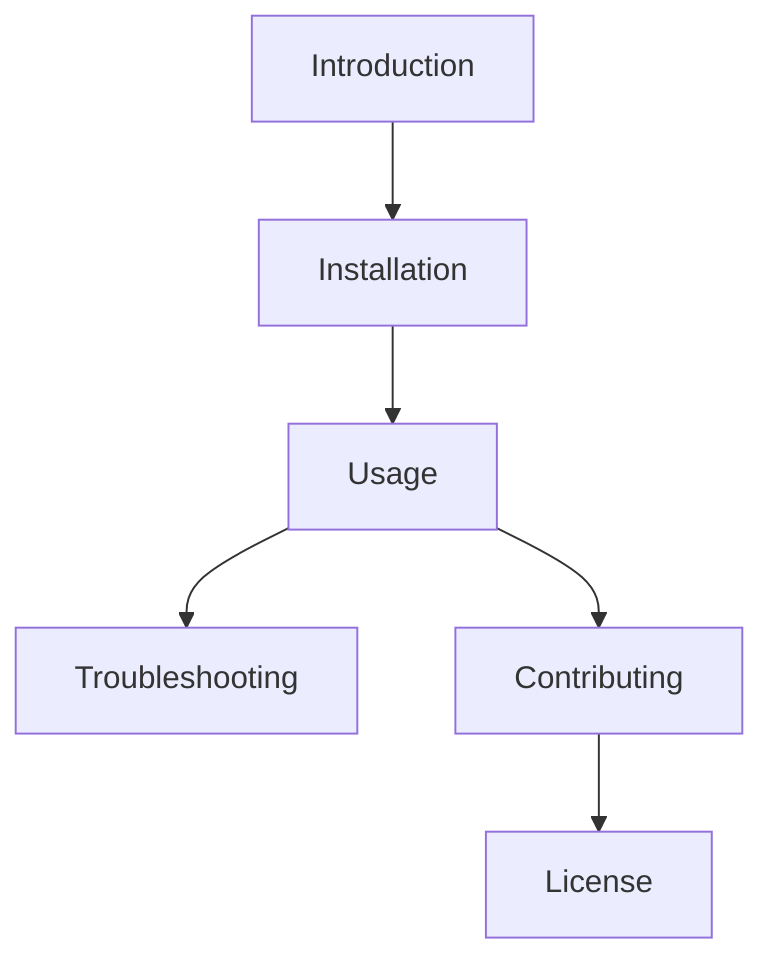

# Project Title

Brief description of your project.

## Flowchart Overview

## Introduction

This section introduces your project.

## Installation

Instructions to install and set up your project.

## Usage

How to use your project.

## Troubleshooting

Common problems and solutions.

## Contributing

Guidelines for contributing to your project.

## License

Information about your project's license.
